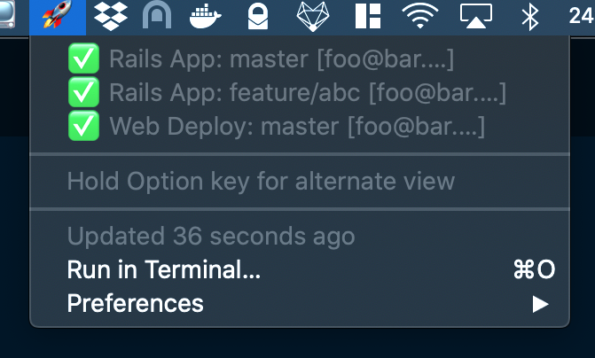
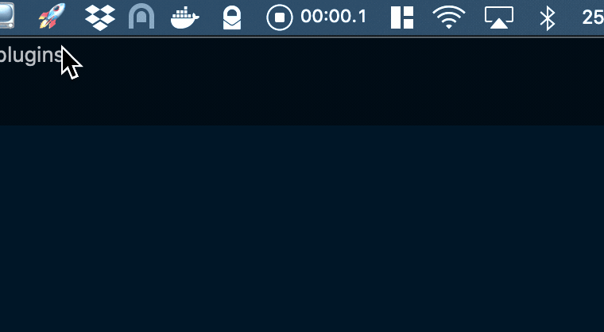

# Bitbar Buildkite Plugin

A [Bitbar][bitbar] plugin to display your recent [Buildkite][buildkite] builds on the OS X menu bar.

## Features

The menu bar shows a count of active builds.  When expanded the popup shows all recent builds.



Holding the `Option` key shows some additional information about each build:


Here's a video showing it in action:



## Installation

1. Install [Bitbar][bitbar] and [jq][jq].
2. Download the latest version of the script and place it in your Bitbar plugins folder.
3. Make the plugin executable by running `chmod +x {filename}`.
4. Provide your Buildkite.com API key in the script file by editing this line:
    ```bash
    BUILD_KITE_API_TOKEN="ABC" # <- replace ABC with your token
    ```

[bitbar]: https://getbitbar.com/
[jq]: https://stedolan.github.io/jq/
[buildkite]: https://buildkite.com/
